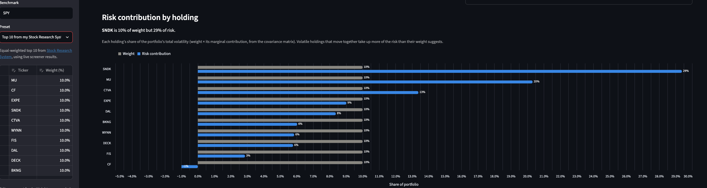

# risk-dashboard

[Try the live demo](https://henry-risk-dashboard.streamlit.app)



Portfolio risk report from a `ticker,shares` CSV: concentration, annualized volatility, beta, and 1-day Value-at-Risk computed from a year of daily returns.

## Run

Requires Python 3.10+.

```bash
pip install -r requirements.txt
python3 risk_dashboard.py                    # reads positions.csv (sample portfolio included)
python3 risk_dashboard.py --file my.csv --benchmark QQQ --var-confidence 0.99
```

To run the interactive web app locally:

```bash
streamlit run app.py                         # opens http://localhost:8501
```

The web app adds:

- **Editable portfolio** – change tickers and weights in the sidebar; weights are rescaled to 100%.
- **Preset portfolios** – Custom (`positions.csv`), 60/40 (SPY/AGG), All tech (AAPL, MSFT, NVDA, GOOGL, META), and the equal-weighted top 10 from my [Stock Research System](https://github.com/Hmelconian21/Stock-Research-System) screener, read live from its `screener_results.txt` (falls back to a saved snapshot if the fetch fails).
- **Risk metrics with plain-English explanations** – volatility, max drawdown, beta, Sharpe ratio, and 1-day VaR, each with a one-sentence note on what the number means.
- **Risk contribution by holding** – each holding's share of total portfolio volatility (weight × marginal contribution, from the covariance matrix) charted against its weight, with a takeaway like "SNDK is 10% of weight but 34% of risk."
- **Charts** – cumulative return vs. a benchmark and a correlation heatmap between holdings.
- **Concentration warning** for any single stock over 25% of the portfolio (broad index ETFs like SPY or AGG are exempt).

Edit `positions.csv` with your own holdings. Educational tool, not investment advice.
